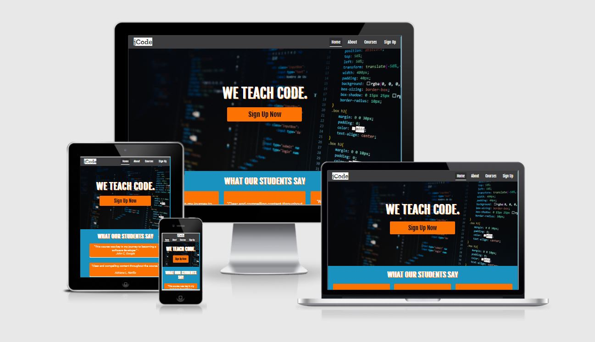

# jCode Online Coding Bootcamp

[View deployed site here](https://jacobshortall.github.io/jcode-bootcamp/index.html)

This is the marketing site for jCode. jCode is an online coding bootcamp, focused on providing completely bespoke courses. This platform is unique in the sense that potential students get in touch to have a course tailored to them and their needs.

The site is designed to be responsive and accessible on all devices, meaning it is easy to navigate for potential students.

## UX

### Purpose

jCode allows students to learn on their terms. Everyone is different, and so are their learning styles. We recognise this, and give learners the chance to create their own journey. 

Two main course structures are offered: an interview/data structures course, and a full-stack web development course. jCode will offer all relevant information for potential students to decide on a course, and prompt them to get in touch with the team to begin their bespoke plan. The site will provide potential students with figures of previous success, in an attempt to convince them to invest in the service.

People live busy lives, and this platform aims to provide all with a chance at learning to program.

### User Goals

Users visiting this site are searching for:
* A place to learn how to code in their own time.
* Information on different course types.
* An organisation to contact to discuss whether coding would be for them.

### User Stories
    
* As a first time visitor, I want the purpose of the website to be immediately clear and to be enticed by the content of the platform.
* As a first time visitor, I want to be able to navigate through the site with ease and find what I'm looking for.
* As a first time visitor, I want to be able to easily check social media accounts to determine trust.
* As a potential student, I want to see stories of success/legitimacy to know that this is a trusted organisation.
* As a potential student, I want to be able to compare the courses available.
* As a potential student, I want to be able to quickly and easily contact the business.
* As a returning visitor, I want to be able to quickly compare reviews & stories of success against information I have found from competitors.
* As a returning visitor, who has already contacted the business, I want to be able to easily sign up for the course of my choice.

### Business Goals

This business aims to:
* Encourage people to sign up for a course.
* Generate more leads via contact form.
* Increase web traffic and be discovered by a larger audience.

### Design

* Colour Scheme
    * The three main colours used across jCode are blue, orange and grey.

* Typography
    * The Fjalla One font is the font used for titles across the website, and Roboto is used for all paragraphs, with Sans-Serif as the fallback for both, in case the font isn't being imported to the site correctly for a user. These are both very clean fonts, with a modern feel, making them appropriate for clearly representing the information across the site. 

* Imagery
    * The imagery across the site is relevant and coherent. Images are large, and eye-catching, but not stretched or pixelated. They are relevant to the meaning the site is trying to convey, providing a clean, modern aesthetic.
    
[Project Wireframes](wireframes/p1-wireframes.pdf) (These wireframes do not necessarily fully represent the final design.)
## Features

### Existing Features

* Header Navigation Bar - This is present across all pages, allowing users to navigate easily and quickly through the pages of the site. The navigation element for the active page is styled so it's clear where the user currently is on the site.
* Header Logo - Conforming to the conventional placement of a logo, the element is placed in the top left of the header and is present across all pages. When clicked, this will take the user back to the home page.
* Footer Contact Button - A contact button is present in the footer across all pages. When clicked, this sends the user directly to the contact form on the sign up page, so they can address any queries they may have before actually signing up.
* Footer Address - The business address is present in the footer across medium/large devices where there is space for it without looking cluttered.
* Footer Socials - Icons linking to the social media are present in the footer across all pages. These links have appropriate aria-labels for accessibility, and all open in a new tab.
* Home Page - Users are instantly presented with a clear hero image, and a call to action that aligns with the business goals and user stories, to promote more people signing up.
* Home Page Testimonials - Positive reviews are presented on the home page, so users instantly know that this organisation is highly-rated and legitimate.
* Home Page Hiring - A small section dedicated to showcasing the companies that alumni now work for. 
* Home Page Course Overview - A brief of each course offered, so users can quickly see exactly what is available.
* Home Page Tutor Section - A small section dedicated to showcasing the legitimacy of tutors, helping to reinforce the user's idea of a successful business.
* About Page - Allows users to find out more about the business origin and location.
* Courses Page - A more detailed view of both courses offered, including a rundown of the syllabus.
* Sign Up Page - Where users can go and sign up to the course of their choosing. This page also has a general contact form for those who wish to find out more before committing.

### Features to Implement in the Future

* I would like to add small coding challenges to the site, however it was outside the scope of this project.
* More animation/transitions across the site.
* Additional relevant images; I had trouble finding free stock images that were relevant to the content and worth putting in.
* FAQ page.

## Technologies

### Languages Used

* [HTML5](https://en.wikipedia.org/wiki/HTML5)
* [CSS3](https://en.wikipedia.org/wiki/Cascading_Style_Sheets)

### Frameworks, Libraries and Programs Used

* [Google Fonts](https://fonts.google.com/)  
    * This project uses Google Fonts to style fonts across the website.
* [Font Awesome](https://fontawesome.com/)  
    * Font Awesome was used for icons across the site.
* [Balsamiq](https://balsamiq.com/)
    * Balsamiq was used for creating the [wireframes](wireframes/p1-wireframes.pdf) used to design the project.
* [Git](https://git-scm.com/)  
    * Git was used for version control, using Git Bash terminal for Windows to commit and push code.
* [Github](https://github.com/)  
    * Github is used to store the project after being pushed to Git. It is also used for hosting the final site.

## Testing

Find testing information in this separate file: [TESTING.md](TESTING.md)

## Deployment

This project is hosted on Github Pages. This method is as follows:

* Log in to Github at https://github.com/
* Navigate to the project repository you wish to host on Github Pages.
* Click on "Settings" in the menu bar above the repo.
* In the menu bar to the left on the settings page, click "Pages"
* Under "Source", select the dropdown for "Branch" and select "master", or "main" in other cases, and then ensure that the correct directory is selected. In this case it is "root".
* Click save, give up to 5 minutes for the site to deploy. A message will read "Your site is published at..." at the top of the "Pages" page.

## Credits

### Code

* All code is unique and written by the developer.

### Content

* All content was written by the developer.
* Imagery was found from [Pexels](https://www.pexels.com/) - free stock images.

### Acknowledgements 

* Thank you to my mentor, Caleb, for the continuous feedback and support.